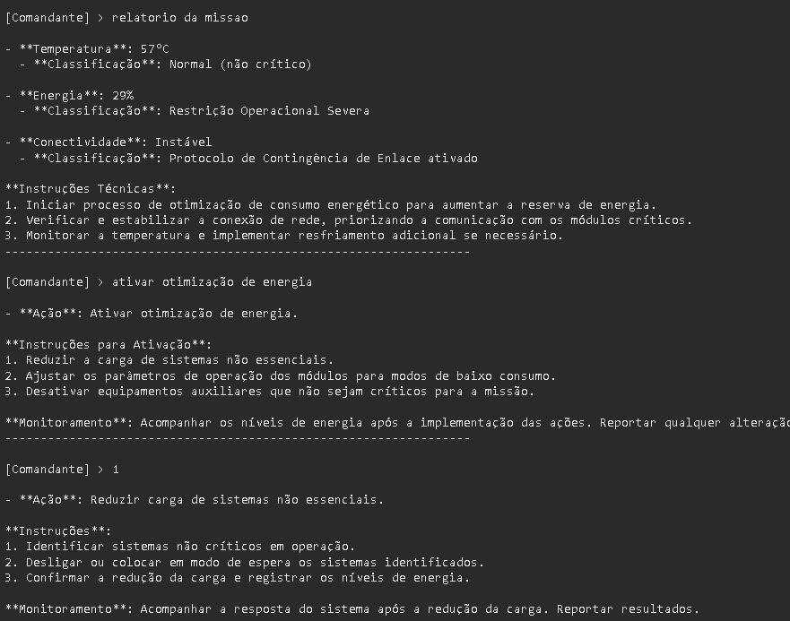
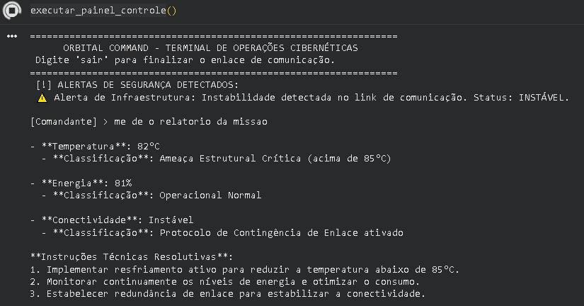

Mission Control AI - Projeto Akali

1. Integrantes: 
Lucca Bertolini - RM: 569552
Raphaello Caffettani - RM: 572334

2. O que o projeto faz/
O sistema desenvolvido simula o monitoramento de uma missão espacial experimental por meio da análise de dados de temperatura, energia e comunicação. Com base nessas informações, regras lógicas identificam situações de risco e geram alertas automáticos. Além disso, uma inteligência artificial interpreta os dados recebidos, classifica a gravidade dos problemas e sugere ações corretivas para auxiliar na tomada de decisão da missão.

3. Print 1

Print 2 

4. Como executar?
Abra o Google Colab: https://colab.research.google.com/drive/17HOmBI9eaoF8v_JDV0Jmp4lR0SZJDBRk?usp=sharing
Execute as células em ordem. O modelo será instalado automaticamente.

5. Video demonstração
Link no Youtube: https://youtu.be/RqOWa4COZq8
